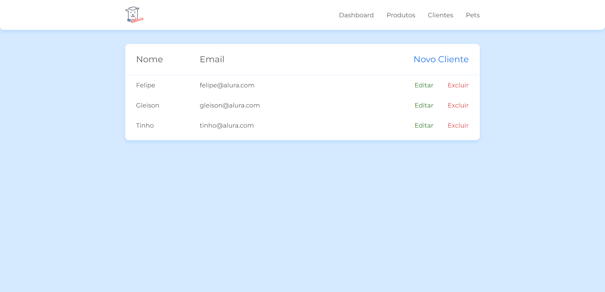
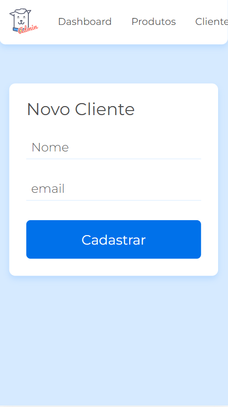

 <h1>Programa de Formação - Desenvolve 2023</h1>
 <h2>Doguito Petshop<h2>

---

## 💻 Sobre o Projeto

Este projeto consiste em uma aplicação web responsiva desenvolvida durante a etapa de de aprendizagem do Programa de Formação - Desenvolve 2023.
O <strong>Doguito Petshop</strong> é uma aplicação onde o foco está direcionado a criar um CRUD com JavaScript utilizando o método fetch e os verbos HTTP, consumir dados de uma API e exibir no front-end.
Projeto criado no curso JS na web: CRUD com JavaScript assíncrono, idealizada no ambito educacional, para o processo de aprendizagem das tecnologias em volvidades.

---

## ✅ Demonstração da aplicação

### 💻 Desktop

<h1 align="center">
  
</h1>

### 📱 Mobile

<h1 align="center">
  
</h1>

---

## 🛠️ Tecnologias Utilizadas

---

## ⚙️ Executando o projeto localmente (Linux ou Windows)

### Pré-requisitos

- Ter um navegador web instalado.
- Git.
- Recomendo ter o Visual Studio Code instalado.

### Instalação e execução

- Clone o repositório em um diretório de sua preferência
         
      git clone https://github.com/gleisonfernandes/validacaoDoguito.git

- Abra o diretório do projeto no Visual Studio Code.
- Abra o terminal do Visual Studio Code e execute os comandos nessa mesma sequência

      npm install

      npx json-server --watch db.json

- Utilizando Visual Studio Code, instale uma extensão chamada “live server”.
- Após instalada essa extensão, var até o arquivo lista_clientes.html e no canto inferior direito do Visual Studio Code vai ter uma opção chamada “Go live”. Clicando nessa opção, ele vai abrir uma nova aba no navegador automaticamente executando o arquivo lista_clientes.html.

---

## 🚀 Estudante

|_Gleison Fernandes_|
|---|
||
|_Desenvolvedor_|
|    |